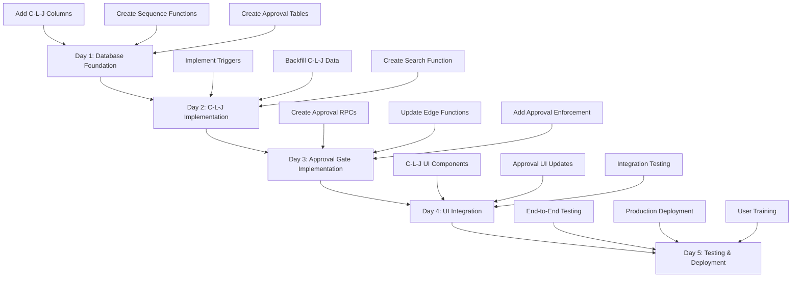

# Phase 1: Core Business Logic - Unified Implementation Plan
## Manager Approval Gate + C-L-J Numbering System

**Timeline**: 4-5 working days (32-40 hours)  
**Priority**: CRITICAL - Foundation for all future features

---

## 🎯 Combined Objectives

### Phase 1A: Manager Approval Gate
Implement hard gate preventing Lead → Project conversion without manager approval for high-value deals (>$25K).

### Phase 1B: C-L-J Numbering System  
Implement unified Contact-Lead-Job numbering (format: `C-L-J`) for clear traceability across customer lifecycle.

### Integration Points
- Approval requests display C-L-J numbers for easy reference
- Manager approval queue sortable by C-L-J
- Approval history tracks C-L-J numbers
- Search functionality works across both systems

---

## 📊 Implementation Order & Dependencies



---

## 📅 Day-by-Day Implementation Schedule

### **DAY 1: Database Foundation (8 hours)**

#### Morning (4 hours): C-L-J Schema Setup
```sql
-- 1. Add C-L-J columns to all tables
ALTER TABLE public.contacts
  ADD COLUMN contact_number INTEGER,
  ADD COLUMN clj_formatted_number TEXT;

ALTER TABLE public.pipeline_entries
  ADD COLUMN contact_number INTEGER,
  ADD COLUMN lead_number INTEGER,
  ADD COLUMN clj_formatted_number TEXT;

ALTER TABLE public.projects
  ADD COLUMN contact_number INTEGER,
  ADD COLUMN lead_number INTEGER,
  ADD COLUMN job_number INTEGER,
  ADD COLUMN clj_formatted_number TEXT;

-- 2. Create indexes
CREATE INDEX idx_contacts_contact_number ON public.contacts(tenant_id, contact_number);
CREATE INDEX idx_contacts_clj_formatted ON public.contacts(tenant_id, clj_formatted_number);
CREATE INDEX idx_pipeline_entries_clj_formatted ON public.pipeline_entries(tenant_id, clj_formatted_number);
CREATE INDEX idx_projects_clj_formatted ON public.projects(tenant_id, clj_formatted_number);

-- 3. Create sequence functions
CREATE OR REPLACE FUNCTION public.get_next_contact_number(tenant_id_param UUID)
RETURNS INTEGER
LANGUAGE plpgsql
SECURITY DEFINER
AS $$
DECLARE
  next_number INTEGER;
BEGIN
  SELECT COALESCE(MAX(contact_number), 0) + 1 INTO next_number
  FROM public.contacts
  WHERE tenant_id = tenant_id_param;
  
  RETURN next_number;
END;
$$;

CREATE OR REPLACE FUNCTION public.get_next_lead_number(contact_id_param UUID)
RETURNS INTEGER
LANGUAGE plpgsql
SECURITY DEFINER
AS $$
DECLARE
  next_number INTEGER;
BEGIN
  SELECT COALESCE(MAX(lead_number), 0) + 1 INTO next_number
  FROM public.pipeline_entries
  WHERE contact_id = contact_id_param;
  
  RETURN next_number;
END;
$$;

CREATE OR REPLACE FUNCTION public.get_next_job_number(pipeline_entry_id_param UUID)
RETURNS INTEGER
LANGUAGE plpgsql
SECURITY DEFINER
AS $$
DECLARE
  next_number INTEGER;
BEGIN
  SELECT COALESCE(MAX(job_number), 0) + 1 INTO next_number
  FROM public.projects
  WHERE pipeline_entry_id = pipeline_entry_id_param;
  
  RETURN next_number;
END;
$$;

CREATE OR REPLACE FUNCTION public.format_clj_number(
  contact_num INTEGER,
  lead_num INTEGER DEFAULT 0,
  job_num INTEGER DEFAULT 0
)
RETURNS TEXT
LANGUAGE plpgsql
IMMUTABLE
AS $$
BEGIN
  RETURN format('%s-%s-%s', contact_num, lead_num, job_num);
END;
$$;
```

#### Afternoon (4 hours): Manager Approval Schema
```sql
-- 1. Update manager_approval_queue table (already exists, verify columns)
-- Add any missing columns
ALTER TABLE public.manager_approval_queue
  ADD COLUMN IF NOT EXISTS expires_at TIMESTAMP WITH TIME ZONE DEFAULT (now() + INTERVAL '7 days'),
  ADD COLUMN IF NOT EXISTS reviewed_at TIMESTAMP WITH TIME ZONE,
  ADD COLUMN IF NOT EXISTS reviewed_by UUID REFERENCES auth.users(id);

-- 2. Ensure pipeline status supports new state
ALTER TABLE public.pipeline_entries 
  DROP CONSTRAINT IF EXISTS pipeline_entries_status_check;

ALTER TABLE public.pipeline_entries 
  ADD CONSTRAINT pipeline_entries_status_check 
  CHECK (status IN (
    'active', 
    'on_hold', 
    'on_hold_mgr_review',
    'converted', 
    'lost', 
    'cancelled'
  ));

-- 3. Update RLS policies if needed
-- (Already exist based on schema analysis)

-- 4. Create indexes for approval queue
CREATE INDEX IF NOT EXISTS idx_manager_approval_queue_tenant ON public.manager_approval_queue(tenant_id);
CREATE INDEX IF NOT EXISTS idx_manager_approval_queue_status ON public.manager_approval_queue(status);
CREATE INDEX IF NOT EXISTS idx_manager_approval_queue_pipeline ON public.manager_approval_queue(pipeline_entry_id);
```

**Deliverables**:
- ✅ All database columns added
- ✅ Sequence functions created
- ✅ Approval queue table verified
- ✅ All indexes created
- ✅ Constraints updated

---

### **DAY 2: C-L-J Numbering Implementation (8 hours)**

#### Morning (4 hours): Triggers & Automation
```sql
-- 1. Contact number trigger
CREATE OR REPLACE FUNCTION public.assign_contact_number()
RETURNS TRIGGER
LANGUAGE plpgsql
SECURITY DEFINER
AS $$
BEGIN
  IF NEW.contact_number IS NULL THEN
    NEW.contact_number := public.get_next_contact_number(NEW.tenant_id);
  END IF;
  
  NEW.clj_formatted_number := public.format_clj_number(NEW.contact_number, 0, 0);
  
  RETURN NEW;
END;
$$;

CREATE TRIGGER trigger_assign_contact_number
  BEFORE INSERT ON public.contacts
  FOR EACH ROW
  EXECUTE FUNCTION public.assign_contact_number();

-- 2. Lead number trigger
CREATE OR REPLACE FUNCTION public.assign_lead_number()
RETURNS TRIGGER
LANGUAGE plpgsql
SECURITY DEFINER
AS $$
DECLARE
  contact_num INTEGER;
BEGIN
  SELECT contact_number INTO contact_num
  FROM public.contacts
  WHERE id = NEW.contact_id;
  
  IF NEW.lead_number IS NULL THEN
    NEW.lead_number := public.get_next_lead_number(NEW.contact_id);
  END IF;
  
  NEW.contact_number := contact_num;
  NEW.clj_formatted_number := public.format_clj_number(contact_num, NEW.lead_number, 0);
  
  RETURN NEW;
END;
$$;

CREATE TRIGGER trigger_assign_lead_number
  BEFORE INSERT ON public.pipeline_entries
  FOR EACH ROW
  EXECUTE FUNCTION public.assign_lead_number();

-- 3. Job number trigger
CREATE OR REPLACE FUNCTION public.assign_job_number()
RETURNS TRIGGER
LANGUAGE plpgsql
SECURITY DEFINER
AS $$
DECLARE
  contact_num INTEGER;
  lead_num INTEGER;
BEGIN
  SELECT 
    pe.contact_number,
    pe.lead_number
  INTO contact_num, lead_num
  FROM public.pipeline_entries pe
  WHERE pe.id = NEW.pipeline_entry_id;
  
  IF NEW.job_number IS NULL THEN
    NEW.job_number := public.get_next_job_number(NEW.pipeline_entry_id);
  END IF;
  
  NEW.contact_number := contact_num;
  NEW.lead_number := lead_num;
  NEW.clj_formatted_number := public.format_clj_number(contact_num, lead_num, NEW.job_number);
  
  RETURN NEW;
END;
$$;

CREATE TRIGGER trigger_assign_job_number
  BEFORE INSERT ON public.projects
  FOR EACH ROW
  EXECUTE FUNCTION public.assign_job_number();
```

#### Afternoon (4 hours): Backfill & Search
```sql
-- 1. Backfill existing records with C-L-J numbers
DO $$
DECLARE
  tenant_rec RECORD;
  contact_rec RECORD;
  lead_rec RECORD;
  project_rec RECORD;
  contact_counter INTEGER;
  lead_counter INTEGER;
  job_counter INTEGER;
BEGIN
  FOR tenant_rec IN SELECT DISTINCT tenant_id FROM public.contacts LOOP
    contact_counter := 1;
    
    FOR contact_rec IN 
      SELECT id FROM public.contacts 
      WHERE tenant_id = tenant_rec.tenant_id 
      ORDER BY created_at, id
    LOOP
      UPDATE public.contacts
      SET 
        contact_number = contact_counter,
        clj_formatted_number = format_clj_number(contact_counter, 0, 0)
      WHERE id = contact_rec.id;
      
      lead_counter := 1;
      FOR lead_rec IN 
        SELECT id FROM public.pipeline_entries 
        WHERE contact_id = contact_rec.id 
        ORDER BY created_at, id
      LOOP
        UPDATE public.pipeline_entries
        SET 
          contact_number = contact_counter,
          lead_number = lead_counter,
          clj_formatted_number = format_clj_number(contact_counter, lead_counter, 0)
        WHERE id = lead_rec.id;
        
        job_counter := 1;
        FOR project_rec IN 
          SELECT id FROM public.projects 
          WHERE pipeline_entry_id = lead_rec.id 
          ORDER BY created_at, id
        LOOP
          UPDATE public.projects
          SET 
            contact_number = contact_counter,
            lead_number = lead_counter,
            job_number = job_counter,
            clj_formatted_number = format_clj_number(contact_counter, lead_counter, job_counter)
          WHERE id = project_rec.id;
          
          job_counter := job_counter + 1;
        END LOOP;
        
        lead_counter := lead_counter + 1;
      END LOOP;
      
      contact_counter := contact_counter + 1;
    END LOOP;
  END LOOP;
  
  RAISE NOTICE 'C-L-J backfill completed successfully';
END $$;

-- 2. Create search function
CREATE OR REPLACE FUNCTION public.search_by_clj_number(
  tenant_id_param UUID,
  clj_search TEXT
)
RETURNS TABLE (
  entity_type TEXT,
  entity_id UUID,
  clj_number TEXT,
  entity_name TEXT,
  entity_status TEXT,
  created_at TIMESTAMP WITH TIME ZONE
)
LANGUAGE plpgsql
SECURITY DEFINER
AS $$
BEGIN
  RETURN QUERY
  SELECT 
    'contact'::TEXT,
    c.id,
    c.clj_formatted_number,
    (c.first_name || ' ' || c.last_name)::TEXT,
    c.status,
    c.created_at
  FROM public.contacts c
  WHERE c.tenant_id = tenant_id_param
    AND c.clj_formatted_number ILIKE '%' || clj_search || '%';
  
  RETURN QUERY
  SELECT 
    'lead'::TEXT,
    pe.id,
    pe.clj_formatted_number,
    (c.first_name || ' ' || c.last_name || ' - ' || pe.stage)::TEXT,
    pe.status,
    pe.created_at
  FROM public.pipeline_entries pe
  JOIN public.contacts c ON c.id = pe.contact_id
  WHERE pe.tenant_id = tenant_id_param
    AND pe.clj_formatted_number ILIKE '%' || clj_search || '%';
  
  RETURN QUERY
  SELECT 
    'job'::TEXT,
    p.id,
    p.clj_formatted_number,
    p.name::TEXT,
    p.status,
    p.created_at
  FROM public.projects p
  WHERE p.tenant_id = tenant_id_param
    AND p.clj_formatted_number ILIKE '%' || clj_search || '%';
END;
$$;
```

**Deliverables**:
- ✅ All triggers created and tested
- ✅ Backfill script executed successfully
- ✅ Search function implemented
- ✅ Verify new records get C-L-J automatically

---

### **DAY 3: Manager Approval Gate Implementation (8 hours)**

#### Morning (4 hours): RPC Functions
```sql
-- 1. Request approval RPC
CREATE OR REPLACE FUNCTION public.api_request_manager_approval(
  pipeline_entry_id_param UUID,
  estimated_value_param DECIMAL,
  business_justification_param TEXT
)
RETURNS JSON
LANGUAGE plpgsql
SECURITY DEFINER
AS $$
DECLARE
  v_tenant_id UUID;
  v_user_id UUID;
  v_approval_id UUID;
  v_pipeline_status TEXT;
  v_priority TEXT;
  v_contact_id UUID;
  v_clj_number TEXT;
BEGIN
  v_user_id := auth.uid();
  IF v_user_id IS NULL THEN
    RETURN json_build_object('success', false, 'error', 'Not authenticated');
  END IF;

  SELECT tenant_id INTO v_tenant_id
  FROM public.profiles
  WHERE user_id = v_user_id;

  IF v_tenant_id IS NULL THEN
    RETURN json_build_object('success', false, 'error', 'User profile not found');
  END IF;

  -- Get pipeline entry details including C-L-J number
  SELECT status, contact_id, clj_formatted_number 
  INTO v_pipeline_status, v_contact_id, v_clj_number
  FROM public.pipeline_entries
  WHERE id = pipeline_entry_id_param AND tenant_id = v_tenant_id;

  IF v_pipeline_status IS NULL THEN
    RETURN json_build_object('success', false, 'error', 'Pipeline entry not found');
  END IF;

  -- Check for existing pending approval
  IF EXISTS (
    SELECT 1 FROM public.manager_approval_queue
    WHERE pipeline_entry_id = pipeline_entry_id_param
    AND status = 'pending'
  ) THEN
    RETURN json_build_object('success', false, 'error', 'Approval request already pending');
  END IF;

  -- Determine priority
  IF estimated_value_param > 50000 THEN
    v_priority := 'high';
  ELSIF estimated_value_param > 25000 THEN
    v_priority := 'medium';
  ELSE
    v_priority := 'low';
  END IF;

  -- Create approval request
  INSERT INTO public.manager_approval_queue (
    tenant_id,
    pipeline_entry_id,
    contact_id,
    requested_by,
    estimated_value,
    business_justification,
    priority
  ) VALUES (
    v_tenant_id,
    pipeline_entry_id_param,
    v_contact_id,
    v_user_id,
    estimated_value_param,
    business_justification_param,
    v_priority
  ) RETURNING id INTO v_approval_id;

  -- Update pipeline status
  UPDATE public.pipeline_entries
  SET status = 'on_hold_mgr_review'
  WHERE id = pipeline_entry_id_param;

  -- Log in communication history
  INSERT INTO public.communication_history (
    tenant_id,
    contact_id,
    communication_type,
    direction,
    subject,
    body,
    status
  ) VALUES (
    v_tenant_id,
    v_contact_id,
    'internal_note',
    'internal',
    format('Manager Approval Requested - C-L-J: %s', v_clj_number),
    format('Approval requested for estimated value: $%s. Justification: %s', 
      estimated_value_param, 
      business_justification_param
    ),
    'completed'
  );

  RETURN json_build_object(
    'success', true,
    'approval_id', v_approval_id,
    'priority', v_priority,
    'clj_number', v_clj_number
  );
END;
$$;

-- 2. Respond to approval RPC
CREATE OR REPLACE FUNCTION public.api_respond_to_approval_request(
  approval_id_param UUID,
  action_param TEXT,
  manager_notes_param TEXT DEFAULT NULL
)
RETURNS JSON
LANGUAGE plpgsql
SECURITY DEFINER
AS $$
DECLARE
  v_tenant_id UUID;
  v_user_id UUID;
  v_user_role TEXT;
  v_pipeline_entry_id UUID;
  v_contact_id UUID;
  v_approval_status TEXT;
  v_clj_number TEXT;
BEGIN
  v_user_id := auth.uid();
  IF v_user_id IS NULL THEN
    RETURN json_build_object('success', false, 'error', 'Not authenticated');
  END IF;

  SELECT tenant_id, role INTO v_tenant_id, v_user_role
  FROM public.profiles
  WHERE user_id = v_user_id;

  IF v_user_role NOT IN ('admin', 'manager') THEN
    RETURN json_build_object('success', false, 'error', 'Insufficient permissions');
  END IF;

  -- Get approval details
  SELECT pipeline_entry_id, contact_id, status 
  INTO v_pipeline_entry_id, v_contact_id, v_approval_status
  FROM public.manager_approval_queue
  WHERE id = approval_id_param AND tenant_id = v_tenant_id;

  IF v_pipeline_entry_id IS NULL THEN
    RETURN json_build_object('success', false, 'error', 'Approval request not found');
  END IF;

  IF v_approval_status != 'pending' THEN
    RETURN json_build_object('success', false, 'error', 'Request already processed');
  END IF;

  -- Get C-L-J number
  SELECT clj_formatted_number INTO v_clj_number
  FROM public.pipeline_entries
  WHERE id = v_pipeline_entry_id;

  -- Update approval request
  UPDATE public.manager_approval_queue
  SET 
    status = CASE WHEN action_param = 'approve' THEN 'approved' ELSE 'rejected' END,
    reviewed_by = v_user_id,
    reviewed_at = now(),
    manager_notes = manager_notes_param
  WHERE id = approval_id_param;

  -- Log in history table
  INSERT INTO public.manager_approval_history (
    tenant_id,
    approval_queue_id,
    performed_by,
    action,
    previous_status,
    new_status,
    notes
  ) VALUES (
    v_tenant_id,
    approval_id_param,
    v_user_id,
    action_param,
    'pending',
    CASE WHEN action_param = 'approve' THEN 'approved' ELSE 'rejected' END,
    manager_notes_param
  );

  -- Update pipeline status
  IF action_param = 'approve' THEN
    UPDATE public.pipeline_entries
    SET status = 'active'
    WHERE id = v_pipeline_entry_id;
  ELSE
    UPDATE public.pipeline_entries
    SET status = 'on_hold'
    WHERE id = v_pipeline_entry_id;
  END IF;

  -- Log decision
  INSERT INTO public.communication_history (
    tenant_id,
    contact_id,
    communication_type,
    direction,
    subject,
    body,
    status
  ) VALUES (
    v_tenant_id,
    v_contact_id,
    'internal_note',
    'internal',
    format('Manager Approval %s - C-L-J: %s', 
      CASE WHEN action_param = 'approve' THEN 'APPROVED' ELSE 'REJECTED' END,
      v_clj_number
    ),
    format('Manager notes: %s', COALESCE(manager_notes_param, 'None')),
    'completed'
  );

  RETURN json_build_object(
    'success', true,
    'action', action_param,
    'pipeline_entry_id', v_pipeline_entry_id,
    'clj_number', v_clj_number
  );
END;
$$;
```

#### Afternoon (4 hours): Edge Function Updates
```typescript
// supabase/functions/api-approve-job-from-lead/index.ts
// Add approval check before conversion

// After authentication and getting user profile...
const userRole = profile.role;
const estimatedValue = jobDetails.estimated_value || 0;

// Check if approval is required
if (estimatedValue > 25000 && userRole !== 'admin') {
  // Check for approved manager approval
  const { data: approvalCheck, error: approvalError } = await supabaseAdmin
    .from('manager_approval_queue')
    .select('*')
    .eq('pipeline_entry_id', pipelineEntryId)
    .eq('status', 'approved')
    .order('reviewed_at', { ascending: false })
    .limit(1)
    .single();

  if (approvalError || !approvalCheck) {
    return new Response(
      JSON.stringify({ 
        error: 'Manager approval required for projects over $25,000. Please request approval first.',
        requires_approval: true,
        estimated_value: estimatedValue
      }),
      { 
        status: 403,
        headers: { ...corsHeaders, 'Content-Type': 'application/json' }
      }
    );
  }
}

// Continue with existing project creation logic...
```

**Deliverables**:
- ✅ RPC functions created
- ✅ Edge function updated with approval check
- ✅ Approval enforcement tested
- ✅ C-L-J integrated into approval flow

---

### **DAY 4: UI Integration (8 hours)**

#### Morning (4 hours): C-L-J UI Components

**Create `src/components/CLJBadge.tsx`:**
```typescript
import { Badge } from '@/components/ui/badge';
import { cn } from '@/lib/utils';

interface CLJBadgeProps {
  cljNumber: string;
  variant?: 'default' | 'outline' | 'secondary';
  className?: string;
  showLabel?: boolean;
}

export const CLJBadge = ({ 
  cljNumber, 
  variant = 'secondary',
  className,
  showLabel = false
}: CLJBadgeProps) => {
  return (
    <Badge variant={variant} className={cn('font-mono', className)}>
      {showLabel && 'C-L-J: '}
      {cljNumber || 'Not assigned'}
    </Badge>
  );
};
```

**Create `src/components/CLJDisplay.tsx`:**
```typescript
import { FileText } from 'lucide-react';
import { CLJBadge } from './CLJBadge';

interface CLJDisplayProps {
  cljNumber: string;
  label?: string;
  className?: string;
}

export const CLJDisplay = ({ cljNumber, label, className }: CLJDisplayProps) => {
  return (
    <div className={cn('flex items-center gap-2', className)}>
      <FileText className="h-4 w-4 text-muted-foreground" />
      {label && <span className="text-sm text-muted-foreground">{label}</span>}
      <CLJBadge cljNumber={cljNumber} />
    </div>
  );
};
```

**Update existing components to display C-L-J numbers:**
- Update contact cards
- Update pipeline cards
- Update project cards
- Update list views

#### Afternoon (4 hours): Approval UI Updates

**Update `src/components/ManagerApprovalDialog.tsx`:**
```typescript
// Already exists, verify it uses the RPC correctly
// Add C-L-J display prominently
// Add better error handling
// Add success confirmations
```

**Update `src/components/ManagerApprovalQueue.tsx`:**
```typescript
// Update to use api_respond_to_approval_request RPC
// Add C-L-J display in queue items
// Add sorting by C-L-J
// Add filtering options
```

**Update `src/components/JobApprovalDialog.tsx`:**
```typescript
// Add approval check before showing conversion
// If approval required and not approved, show ManagerApprovalDialog
// Display C-L-J number
// Show approval status
```

**Deliverables**:
- ✅ CLJBadge component created
- ✅ All existing components updated
- ✅ Approval dialogs updated
- ✅ Manager queue functional

---

### **DAY 5: Testing & Deployment (8 hours)**

#### Morning (4 hours): Comprehensive Testing

**Test Suite 1: C-L-J Numbering**
```typescript
// tests/clj-numbering.test.ts
describe('C-L-J Numbering', () => {
  test('New contact gets C-0-0 format', async () => {
    const contact = await createTestContact();
    expect(contact.clj_formatted_number).toMatch(/^\d+-0-0$/);
  });

  test('New lead gets C-L-0 format', async () => {
    const contact = await createTestContact();
    const lead = await createTestPipelineEntry(contact.id);
    expect(lead.clj_formatted_number).toMatch(/^\d+-\d+-0$/);
  });

  test('Multiple leads get sequential numbers', async () => {
    const contact = await createTestContact();
    const lead1 = await createTestPipelineEntry(contact.id);
    const lead2 = await createTestPipelineEntry(contact.id);
    
    expect(lead1.lead_number).toBe(1);
    expect(lead2.lead_number).toBe(2);
  });

  test('Search by C-L-J returns correct results', async () => {
    // Test search functionality
  });
});
```

**Test Suite 2: Manager Approval**
```typescript
// tests/manager-approval.test.ts
describe('Manager Approval Gate', () => {
  test('High-value lead requires approval', async () => {
    // Create lead with estimate > $25K
    // Attempt conversion without approval
    // Should fail
  });

  test('Approval request creates queue entry', async () => {
    // Request approval
    // Verify queue entry exists
    // Verify status = on_hold_mgr_review
  });

  test('Manager can approve request', async () => {
    // Create approval request
    // Manager approves
    // Verify status updated
  });

  test('Approved lead can convert', async () => {
    // Full workflow test
  });
});
```

**Integration Tests:**
1. Create contact → verify C-L-J
2. Create high-value lead → verify requires approval
3. Request approval → verify C-L-J in approval
4. Manager approves → verify can convert
5. Convert to project → verify full C-L-J assigned
6. Search by C-L-J → verify all entities found

#### Afternoon (4 hours): Production Deployment

**Pre-Deployment Checklist:**
- [ ] All tests passing
- [ ] Database migrations reviewed
- [ ] Staging environment tested
- [ ] Rollback plan documented
- [ ] User documentation prepared

**Deployment Steps:**
1. **Backup database** (critical!)
2. **Deploy database changes** in this order:
   - C-L-J columns
   - Sequence functions
   - Triggers
   - Approval RPC functions
   - Run backfill script
3. **Deploy Edge functions**
4. **Deploy frontend updates**
5. **Verify deployment**
6. **Monitor logs**

**Post-Deployment Verification:**
- [ ] Create test contact and verify C-L-J
- [ ] Create test lead and verify numbering
- [ ] Test approval workflow end-to-end
- [ ] Verify search functionality
- [ ] Check existing records have C-L-J
- [ ] Monitor error logs for 1 hour

**Deliverables**:
- ✅ All tests passing
- ✅ Production deployment complete
- ✅ Verification successful
- ✅ Documentation updated

---

## 🎯 Success Criteria

### Phase 1A: Manager Approval Gate
- [x] Projects > $25K require manager approval
- [x] Non-admin users cannot bypass approval
- [x] Managers receive approval requests immediately
- [x] Approval queue shows all pending requests
- [x] Pipeline status reflects approval state
- [x] Approved requests allow conversion
- [x] Rejected requests return to on-hold

### Phase 1B: C-L-J Numbering
- [x] All contacts have C-0-0 format
- [x] All leads have C-L-0 format
- [x] All projects have C-L-J format
- [x] Numbers are sequential per entity
- [x] No duplicates within tenant
- [x] Search returns results by C-L-J
- [x] UI displays C-L-J prominently

### Integration
- [x] Approval requests show C-L-J numbers
- [x] Manager queue sortable by C-L-J
- [x] Search works across both systems
- [x] Communication logs reference C-L-J

---

## 📊 Testing Matrix

| Feature | Unit Tests | Integration Tests | Manual Tests |
|---------|-----------|-------------------|--------------|
| C-L-J Contact Numbering | ✅ | ✅ | ✅ |
| C-L-J Lead Numbering | ✅ | ✅ | ✅ |
| C-L-J Job Numbering | ✅ | ✅ | ✅ |
| C-L-J Search | ✅ | ✅ | ✅ |
| Approval Request | ✅ | ✅ | ✅ |
| Approval Response | ✅ | ✅ | ✅ |
| Approval Enforcement | ✅ | ✅ | ✅ |
| UI Components | ✅ | ✅ | ✅ |
| End-to-End Workflow | - | ✅ | ✅ |

---

## 🔧 Files to Create/Update

### New Files (13 files)
```
docs/
  ├── phase-1a-manager-approval-gate.md ✅
  ├── phase-1b-clj-numbering-system.md ✅
  └── phase-1-implementation-plan.md ✅

src/components/
  ├── CLJBadge.tsx (NEW)
  ├── CLJDisplay.tsx (NEW)
  └── CLJSearchBar.tsx (NEW)

tests/
  ├── clj-numbering.test.ts (NEW)
  ├── manager-approval.test.ts (NEW)
  └── phase-1-integration.test.ts (NEW)

supabase/migrations/
  ├── YYYYMMDDHHMMSS_add_clj_columns.sql (NEW)
  ├── YYYYMMDDHHMMSS_create_clj_functions.sql (NEW)
  ├── YYYYMMDDHHMMSS_create_clj_triggers.sql (NEW)
  └── YYYYMMDDHHMMSS_create_approval_rpcs.sql (NEW)
```

### Files to Update (8 files)
```
src/components/
  ├── ManagerApprovalDialog.tsx (UPDATE)
  ├── ManagerApprovalQueue.tsx (UPDATE)
  ├── JobApprovalDialog.tsx (UPDATE)
  └── ContactCard.tsx (UPDATE)

supabase/functions/
  └── api-approve-job-from-lead/index.ts (UPDATE)

tests/utils/
  └── db-helpers.ts (UPDATE)
```

---

## 💰 Resource Requirements

### Development Time
- **Database**: 8 hours
- **Backend Logic**: 8 hours
- **Frontend Components**: 8 hours
- **Testing**: 8 hours
- **Total**: 32 hours (4 days)

### Additional Time for Polish
- **Documentation**: 4 hours
- **User Training**: 2 hours
- **Monitoring**: 2 hours
- **Total**: 8 hours (1 day)

**Grand Total**: 40 hours (5 working days)

### Team Requirements
- 1 Full-stack developer
- 1 QA engineer (for testing)
- 1 Technical writer (for documentation)

---

## 🚨 Risk Management

### Potential Risks

| Risk | Probability | Impact | Mitigation |
|------|------------|--------|------------|
| C-L-J numbering conflicts | Low | High | Use database transactions, test thoroughly |
| Backfill script fails | Medium | High | Run on staging first, have rollback |
| Approval bypass vulnerability | Low | Critical | Thorough testing, code review |
| Performance degradation | Low | Medium | Index optimization, monitoring |
| User confusion | Medium | Low | Clear documentation, training |

### Rollback Procedures

**If C-L-J issues occur:**
1. Disable triggers (stop new assignments)
2. Keep existing C-L-J data (don't delete)
3. Revert UI to not display C-L-J
4. Fix issues in development
5. Re-enable when ready

**If approval gate issues occur:**
1. Emergency override: Allow admins to bypass
2. Disable approval enforcement in Edge function
3. Fix RPC functions
4. Test thoroughly
5. Re-enable enforcement

---

## 📚 Documentation Deliverables

### Technical Documentation
1. Database schema changes
2. RPC function specifications
3. Edge function updates
4. Component API documentation

### User Documentation
1. Understanding C-L-J numbers
2. Using the search feature
3. Requesting manager approval
4. Manager approval workflow
5. FAQ section

### Training Materials
1. Video: "Introduction to C-L-J Numbering"
2. Video: "Manager Approval Process"
3. Quick reference card
4. Best practices guide

---

## 🎓 User Training Plan

### Sales Team Training (1 hour)
- What are C-L-J numbers?
- When to request manager approval
- How to use the search feature

### Manager Training (1 hour)
- Reviewing approval requests
- Understanding priority levels
- Best practices for approval decisions

### Support Team Training (30 minutes)
- Helping users understand C-L-J
- Troubleshooting approval issues
- Using C-L-J for customer service

---

## 📈 Success Metrics (30 days post-launch)

### C-L-J Adoption
- [ ] 100% of new contacts have C-L-J numbers
- [ ] 0 duplicate C-L-J numbers detected
- [ ] Average search time < 2 seconds
- [ ] User satisfaction score > 4/5

### Approval Gate Effectiveness
- [ ] 100% of projects > $25K go through approval
- [ ] 0 unauthorized high-value conversions
- [ ] Average approval time < 24 hours
- [ ] Manager satisfaction score > 4/5

### System Performance
- [ ] No performance degradation
- [ ] Database query times within SLA
- [ ] Zero critical bugs reported
- [ ] 99.9% uptime maintained

---

## ✅ Final Checklist

### Before Starting
- [ ] Review both implementation plans
- [ ] Allocate development resources
- [ ] Set up development environment
- [ ] Create feature branch
- [ ] Notify stakeholders

### During Implementation
- [ ] Follow day-by-day schedule
- [ ] Commit code regularly
- [ ] Run tests continuously
- [ ] Document as you go
- [ ] Communicate progress daily

### Before Deployment
- [ ] All tests passing
- [ ] Code review complete
- [ ] Staging tested
- [ ] Documentation complete
- [ ] Training materials ready
- [ ] Rollback plan documented

### After Deployment
- [ ] Verify production deployment
- [ ] Monitor logs for 24 hours
- [ ] Conduct user training
- [ ] Gather initial feedback
- [ ] Address any issues quickly

---

## 🚀 Next Steps After Phase 1

Once Phase 1 is complete and stable, proceed to:

### Phase 2: Customer Experience (Weeks 3-4)
- Customer Portal
- Stripe Payment Links
- Document sharing

### Phase 3: Integrations (Weeks 5-6)
- Address validation
- Weather integration
- Email notifications

### Phase 4: Communications (Weeks 7-8)
- Unified timeline
- Multi-channel support
- Photo management

---

*This unified implementation plan ensures both C-L-J Numbering and Manager Approval Gate are deployed together as a cohesive foundation for the PITCH CRM system.*
