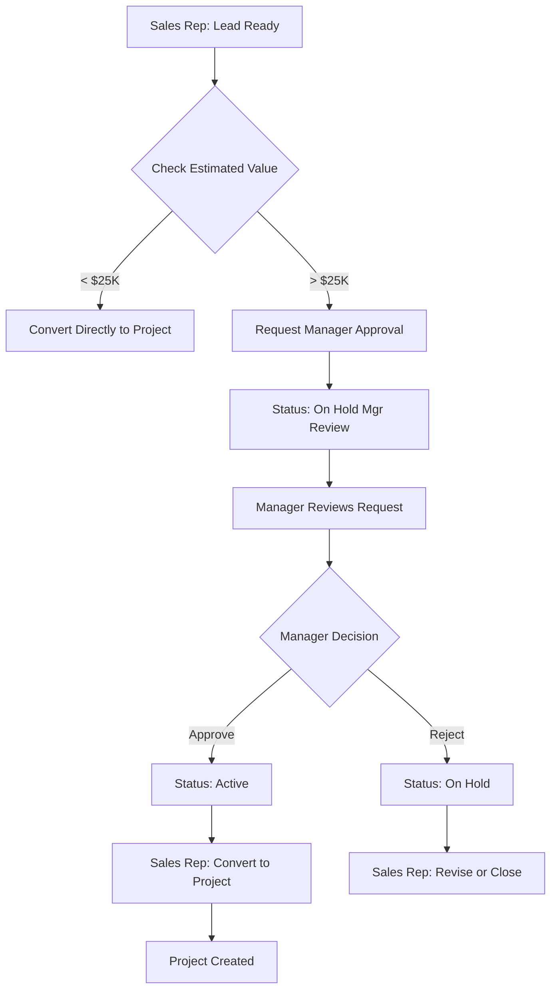

# Phase 1A: Manager Approval Gate System - Implementation Plan

## 🎯 Objective
Implement a hard gate preventing direct Lead → Project conversion without explicit manager approval. This ensures high-value or complex projects receive proper oversight before committing resources.

---

## 📋 Current State Analysis

### ✅ Already Implemented
- `ManagerApprovalDialog.tsx` - UI for requesting approval
- `ManagerApprovalQueue.tsx` - Manager view of pending requests
- `ApprovalManager.tsx` - Legacy approval interface
- `JobApprovalDialog.tsx` - Job conversion dialog
- Edge function: `api-approve-job-from-lead` - Converts leads to projects
- RPC call: `api_request_manager_approval` (referenced but needs verification)

### ❌ Missing Components
- Database table: `manager_approval_queue`
- Database RPC: `api_request_manager_approval`
- Database RPC: `api_respond_to_approval_request`
- Pipeline stage: "On Hold (Mgr Review)"
- Enforcement logic preventing unauthorized conversions
- Approval workflow state machine
- Email notifications for approval requests

---

## 🗄️ Database Implementation

### 1. Create `manager_approval_queue` Table

```sql
-- Table to track manager approval requests
CREATE TABLE public.manager_approval_queue (
  id UUID NOT NULL DEFAULT gen_random_uuid() PRIMARY KEY,
  tenant_id UUID NOT NULL,
  
  -- Request details
  pipeline_entry_id UUID NOT NULL REFERENCES public.pipeline_entries(id) ON DELETE CASCADE,
  requested_by UUID NOT NULL REFERENCES auth.users(id),
  requested_at TIMESTAMP WITH TIME ZONE NOT NULL DEFAULT now(),
  
  -- Business justification
  estimated_value DECIMAL(12,2) NOT NULL,
  business_justification TEXT NOT NULL,
  
  -- Approval workflow
  status TEXT NOT NULL DEFAULT 'pending' CHECK (status IN ('pending', 'approved', 'rejected', 'expired')),
  priority TEXT NOT NULL DEFAULT 'medium' CHECK (priority IN ('low', 'medium', 'high')),
  
  -- Manager response
  reviewed_by UUID REFERENCES auth.users(id),
  reviewed_at TIMESTAMP WITH TIME ZONE,
  manager_notes TEXT,
  
  -- Metadata
  created_at TIMESTAMP WITH TIME ZONE NOT NULL DEFAULT now(),
  updated_at TIMESTAMP WITH TIME ZONE NOT NULL DEFAULT now(),
  expires_at TIMESTAMP WITH TIME ZONE NOT NULL DEFAULT (now() + INTERVAL '7 days')
);

-- Indexes for performance
CREATE INDEX idx_manager_approval_queue_tenant ON public.manager_approval_queue(tenant_id);
CREATE INDEX idx_manager_approval_queue_status ON public.manager_approval_queue(status);
CREATE INDEX idx_manager_approval_queue_pipeline ON public.manager_approval_queue(pipeline_entry_id);
CREATE INDEX idx_manager_approval_queue_requested_by ON public.manager_approval_queue(requested_by);

-- Enable RLS
ALTER TABLE public.manager_approval_queue ENABLE ROW LEVEL SECURITY;

-- RLS Policies
CREATE POLICY "Users can view approvals in their tenant"
  ON public.manager_approval_queue FOR SELECT
  USING (
    tenant_id IN (
      SELECT tenant_id FROM public.profiles WHERE user_id = auth.uid()
    )
  );

CREATE POLICY "Users can create approval requests"
  ON public.manager_approval_queue FOR INSERT
  WITH CHECK (
    tenant_id IN (
      SELECT tenant_id FROM public.profiles WHERE user_id = auth.uid()
    )
    AND requested_by = auth.uid()
  );

CREATE POLICY "Managers can update approval requests"
  ON public.manager_approval_queue FOR UPDATE
  USING (
    tenant_id IN (
      SELECT tenant_id FROM public.profiles 
      WHERE user_id = auth.uid() 
      AND role IN ('admin', 'manager')
    )
  );

-- Trigger for updated_at
CREATE TRIGGER update_manager_approval_queue_updated_at
  BEFORE UPDATE ON public.manager_approval_queue
  FOR EACH ROW
  EXECUTE FUNCTION public.update_updated_at_column();
```

### 2. Add Pipeline Stage

```sql
-- Add "on_hold_mgr_review" to pipeline stages
-- This should be added to any stage enum or validation

-- Update pipeline_entries table to support the new status
ALTER TABLE public.pipeline_entries 
  DROP CONSTRAINT IF EXISTS pipeline_entries_status_check;

ALTER TABLE public.pipeline_entries 
  ADD CONSTRAINT pipeline_entries_status_check 
  CHECK (status IN (
    'active', 
    'on_hold', 
    'on_hold_mgr_review',  -- NEW
    'converted', 
    'lost', 
    'cancelled'
  ));
```

### 3. Create RPC: `api_request_manager_approval`

```sql
-- RPC function to request manager approval
CREATE OR REPLACE FUNCTION public.api_request_manager_approval(
  pipeline_entry_id_param UUID,
  estimated_value_param DECIMAL,
  business_justification_param TEXT
)
RETURNS JSON
LANGUAGE plpgsql
SECURITY DEFINER
AS $$
DECLARE
  v_tenant_id UUID;
  v_user_id UUID;
  v_approval_id UUID;
  v_pipeline_status TEXT;
BEGIN
  -- Get current user
  v_user_id := auth.uid();
  IF v_user_id IS NULL THEN
    RETURN json_build_object('success', false, 'error', 'Not authenticated');
  END IF;

  -- Get tenant_id from profile
  SELECT tenant_id INTO v_tenant_id
  FROM public.profiles
  WHERE user_id = v_user_id;

  IF v_tenant_id IS NULL THEN
    RETURN json_build_object('success', false, 'error', 'User profile not found');
  END IF;

  -- Verify pipeline entry exists and belongs to tenant
  SELECT status INTO v_pipeline_status
  FROM public.pipeline_entries
  WHERE id = pipeline_entry_id_param AND tenant_id = v_tenant_id;

  IF v_pipeline_status IS NULL THEN
    RETURN json_build_object('success', false, 'error', 'Pipeline entry not found');
  END IF;

  -- Check if there's already a pending approval
  IF EXISTS (
    SELECT 1 FROM public.manager_approval_queue
    WHERE pipeline_entry_id = pipeline_entry_id_param
    AND status = 'pending'
  ) THEN
    RETURN json_build_object('success', false, 'error', 'Approval request already pending');
  END IF;

  -- Determine priority based on estimated value
  DECLARE
    v_priority TEXT;
  BEGIN
    IF estimated_value_param > 50000 THEN
      v_priority := 'high';
    ELSIF estimated_value_param > 25000 THEN
      v_priority := 'medium';
    ELSE
      v_priority := 'low';
    END IF;

    -- Create approval request
    INSERT INTO public.manager_approval_queue (
      tenant_id,
      pipeline_entry_id,
      requested_by,
      estimated_value,
      business_justification,
      priority
    ) VALUES (
      v_tenant_id,
      pipeline_entry_id_param,
      v_user_id,
      estimated_value_param,
      business_justification_param,
      v_priority
    ) RETURNING id INTO v_approval_id;

    -- Update pipeline entry status
    UPDATE public.pipeline_entries
    SET status = 'on_hold_mgr_review'
    WHERE id = pipeline_entry_id_param;

    -- Log in communication history
    INSERT INTO public.communication_history (
      tenant_id,
      contact_id,
      communication_type,
      direction,
      subject,
      body,
      status
    )
    SELECT
      v_tenant_id,
      pe.contact_id,
      'internal_note',
      'internal',
      'Manager Approval Requested',
      format('Approval requested for estimated value: $%s. Justification: %s', 
        estimated_value_param, 
        business_justification_param
      ),
      'completed'
    FROM public.pipeline_entries pe
    WHERE pe.id = pipeline_entry_id_param;

    RETURN json_build_object(
      'success', true,
      'approval_id', v_approval_id,
      'priority', v_priority
    );
  END;
END;
$$;
```

### 4. Create RPC: `api_respond_to_approval_request`

```sql
-- RPC function for managers to approve/reject requests
CREATE OR REPLACE FUNCTION public.api_respond_to_approval_request(
  approval_id_param UUID,
  action_param TEXT,  -- 'approve' or 'reject'
  manager_notes_param TEXT DEFAULT NULL
)
RETURNS JSON
LANGUAGE plpgsql
SECURITY DEFINER
AS $$
DECLARE
  v_tenant_id UUID;
  v_user_id UUID;
  v_user_role TEXT;
  v_pipeline_entry_id UUID;
  v_approval_status TEXT;
BEGIN
  -- Get current user
  v_user_id := auth.uid();
  IF v_user_id IS NULL THEN
    RETURN json_build_object('success', false, 'error', 'Not authenticated');
  END IF;

  -- Get user profile and verify manager role
  SELECT tenant_id, role INTO v_tenant_id, v_user_role
  FROM public.profiles
  WHERE user_id = v_user_id;

  IF v_user_role NOT IN ('admin', 'manager') THEN
    RETURN json_build_object('success', false, 'error', 'Insufficient permissions');
  END IF;

  -- Get approval request details
  SELECT pipeline_entry_id, status INTO v_pipeline_entry_id, v_approval_status
  FROM public.manager_approval_queue
  WHERE id = approval_id_param AND tenant_id = v_tenant_id;

  IF v_pipeline_entry_id IS NULL THEN
    RETURN json_build_object('success', false, 'error', 'Approval request not found');
  END IF;

  IF v_approval_status != 'pending' THEN
    RETURN json_build_object('success', false, 'error', 'Request already processed');
  END IF;

  -- Update approval request
  UPDATE public.manager_approval_queue
  SET 
    status = CASE WHEN action_param = 'approve' THEN 'approved' ELSE 'rejected' END,
    reviewed_by = v_user_id,
    reviewed_at = now(),
    manager_notes = manager_notes_param
  WHERE id = approval_id_param;

  -- Update pipeline entry status
  IF action_param = 'approve' THEN
    UPDATE public.pipeline_entries
    SET status = 'active'  -- Return to active, ready for conversion
    WHERE id = v_pipeline_entry_id;
  ELSE
    UPDATE public.pipeline_entries
    SET status = 'on_hold'  -- Move to general hold
    WHERE id = v_pipeline_entry_id;
  END IF;

  -- Log the decision
  INSERT INTO public.communication_history (
    tenant_id,
    contact_id,
    communication_type,
    direction,
    subject,
    body,
    status
  )
  SELECT
    v_tenant_id,
    pe.contact_id,
    'internal_note',
    'internal',
    format('Manager Approval %s', CASE WHEN action_param = 'approve' THEN 'APPROVED' ELSE 'REJECTED' END),
    format('Manager notes: %s', COALESCE(manager_notes_param, 'None')),
    'completed'
  FROM public.pipeline_entries pe
  WHERE pe.id = v_pipeline_entry_id;

  RETURN json_build_object(
    'success', true,
    'action', action_param,
    'pipeline_entry_id', v_pipeline_entry_id
  );
END;
$$;
```

---

## 🎨 UI Components

### 1. Update `ManagerApprovalDialog.tsx`
**Status**: Already exists, needs verification against RPC
- Ensure it correctly calls `api_request_manager_approval`
- Add priority indicator based on estimated value
- Add form validation

### 2. Update `ManagerApprovalQueue.tsx`
**Status**: Already exists, needs integration
- Connect to `manager_approval_queue` table
- Add approve/reject handlers calling `api_respond_to_approval_request`
- Add real-time subscriptions for new requests
- Add filtering (pending/approved/rejected)

### 3. Update `JobApprovalDialog.tsx`
**Status**: Needs approval gate check
- Before allowing conversion, check if approval is required
- If required and not approved, show `ManagerApprovalDialog` instead
- Only allow conversion if approval exists and is approved

### 4. Create `ApprovalGateEnforcer.tsx` (NEW)
**Purpose**: Centralized logic to determine if approval is needed

```typescript
// Pseudocode
export const checkApprovalRequired = (
  estimatedValue: number,
  userRole: string,
  tenantSettings?: any
) => {
  // Approval required if:
  // 1. Estimated value > $25,000
  // 2. User is not admin/manager
  // 3. No existing approved request
  
  if (userRole === 'admin') return false;
  if (estimatedValue > 25000) return true;
  return false;
};
```

---

## ⚙️ Edge Function Updates

### Update `api-approve-job-from-lead/index.ts`
**Add approval verification before conversion:**

```typescript
// Before creating project, check if approval is required
const { data: approvalCheck } = await supabaseAdmin
  .from('manager_approval_queue')
  .select('*')
  .eq('pipeline_entry_id', pipelineEntryId)
  .eq('status', 'approved')
  .order('reviewed_at', { ascending: false })
  .limit(1)
  .single();

// If high-value project and no approval, reject
if (estimatedValue > 25000 && userRole !== 'admin') {
  if (!approvalCheck) {
    return new Response(
      JSON.stringify({ 
        error: 'Manager approval required for projects over $25,000' 
      }),
      { status: 403 }
    );
  }
}
```

---

## 🔔 Notification System

### Email Notifications (Future Enhancement)
- **On Request**: Email managers with approval link
- **On Approval**: Email requester with confirmation
- **On Rejection**: Email requester with reason
- **On Expiry**: Email requester if no action taken in 7 days

### In-App Notifications
- Use existing toast system for immediate feedback
- Add badge count on manager dashboard for pending approvals

---

## 🧪 Testing Plan

### Unit Tests
```typescript
// tests/manager-approval-gate.test.ts
describe('Manager Approval Gate', () => {
  test('Request approval creates queue entry', async () => {
    // Test RPC call
  });
  
  test('High value projects require approval', async () => {
    // Test enforcement
  });
  
  test('Managers can approve/reject requests', async () => {
    // Test manager actions
  });
  
  test('Pipeline status updates correctly', async () => {
    // Test status transitions
  });
});
```

### Integration Tests
1. Create pipeline entry
2. Request approval
3. Verify status = 'on_hold_mgr_review'
4. Manager approves
5. Convert to project successfully

---

## 📊 Success Metrics

1. ✅ All projects > $25K require approval
2. ✅ No unauthorized conversions possible
3. ✅ Managers receive approval requests immediately
4. ✅ Approval workflow completes in < 24 hours on average
5. ✅ Pipeline status accurately reflects approval state

---

## 🚀 Deployment Checklist

### Pre-Deployment
- [ ] Run database migration for `manager_approval_queue` table
- [ ] Deploy RPC functions
- [ ] Update Edge function `api-approve-job-from-lead`
- [ ] Test in development environment

### Deployment
- [ ] Execute SQL migrations in production
- [ ] Deploy Edge functions
- [ ] Deploy UI updates
- [ ] Verify RLS policies

### Post-Deployment
- [ ] Test approval workflow end-to-end
- [ ] Monitor for errors in logs
- [ ] Train managers on new approval queue
- [ ] Document workflow in user guide

---

## 🔄 User Workflow



---

## ⏱️ Estimated Implementation Time

- **Database Setup**: 2 hours
- **RPC Functions**: 3 hours
- **UI Updates**: 4 hours
- **Edge Function Updates**: 2 hours
- **Testing**: 3 hours
- **Documentation**: 1 hour

**Total**: ~15 hours (2 working days)

---

## 📝 Next Steps

1. **Review this plan** with stakeholders
2. **Approve database schema** changes
3. **Begin implementation** with database migration
4. **Test thoroughly** before production deployment
5. **Train users** on new approval process

---

*This plan ensures proper oversight for high-value projects while maintaining workflow efficiency for standard deals.*
